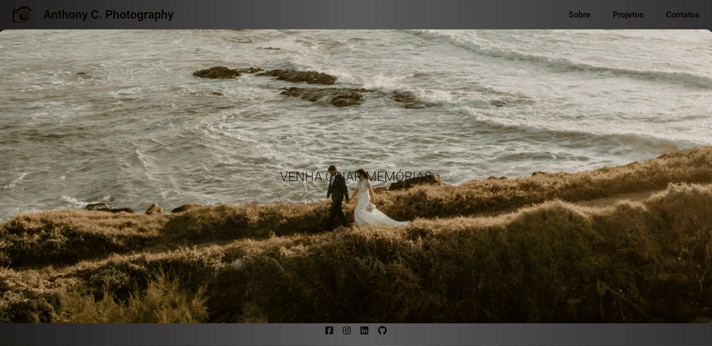
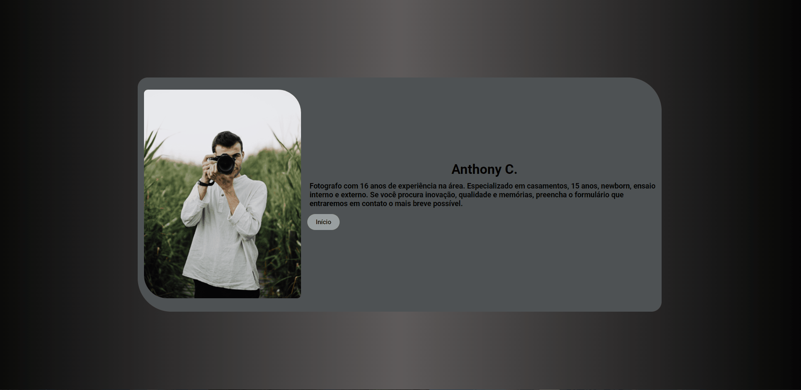
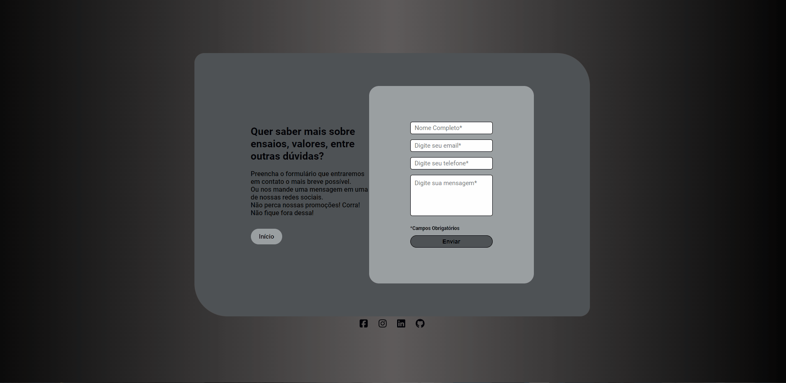

<h1>🚀 Anthony C. Photography 🚀</h1> 

Criei esse projeto para por em prática tudo que aprendi até o momento. A página é simples e com algumas aplicações básicas, como por exemplo: 
- No formulário, os campos não preenchidos ficam vermelhos e com alerta de campo obrigatório. 
- Links clicáveis para todos os atalhos das páginas. 

# Gif Projects

<h2>Pagina incial</h2>

 

<h2>Sobre</h2>

 

<h2>Projetos</h2>

 

<h2>Contatos</h2>

 

### Deployment

[Projeto Pagina de um Fotográfo](...)

## Técnologias Utilizadas:

   
 
 
 

### Redes:

- Linkedin - [Suelen Cardoso](https://www.linkedin.com/in/suelen-s-cardoso/)
 

### Imagens utilizadas:

- [Pexels](https://www.pexels.com/pt-br/)
